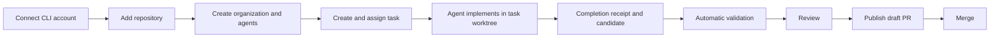

# First-task walkthrough: from installation to a validated handoff

As a first-time user, start with **one repository, one implementation agent and one
small task**. Once that loop works, add reviewers, group discussions and more
autonomous scheduling.

The intended workflow is:

Agent handoff and queued work can continue while earlier tasks await review.
Publishing, merging, updating the shared base and deployment remain separate
operations.

## 1. Prepare the installation

Before assigning work, confirm on **Overview** that Herdr is running and that the
required agent CLI is installed (**CLI accounts**).

For unattended validation, open **Builds & deployments** and confirm the executor
is **service**. The durable build service is required for the automatic
capture-and-validation policy.

If it is unavailable, install it using the dashboard's displayed setup guidance.
The product still has an installation prerequisite here: a first-time operator may
need administrator access to the LXC. Creating an organization does not install
runtimes, credentials or toolchains automatically.

## 2. Connect the account the agents will use

Open **CLI accounts** and connect your chosen runtime and provider.

For example, if you want OpenCode Go:

- Complete the OpenCode provider sign-in.
- Confirm the account status.
- Select the correct provider and model when hiring the agent.
- Use **Test account** as a small readiness check before assigning
  implementation work.

Selecting a model in an agent profile does not itself authenticate its provider.
The runtime must have usable credentials under the account that launches the
agents.

## 3. Add the product repository

Use **Project explorer** to clone or select your repository inside the managed
projects directory.

Then:

- Fetch remote updates.
- Confirm that the repository has an accessible origin branch.
- Check that the shared checkout is clean.

The first task records the repository's configured base branch from the current
remote-tracking commit. Later tasks use that configured base; leaving the form's
base empty resolves the configured base first, then origin's recorded default,
then main or master only when exactly one exists. If neither is unambiguous, the
form asks for an explicit branch such as `refs/remotes/origin/main`.

Agents work in dedicated task branches and worktrees. Their edits should not
happen directly in the shared base checkout.

For the first task, use a repository with a working validation script and
already-installed dependencies. That lets you test the agent workflow without
simultaneously debugging environment setup.

## 4. Create your organization

Open **Org chart** and create an organization.

Give it two concrete pieces of information:

| Field | What I would put there |
|---|---|
| Purpose | What product the team maintains and who it serves |
| Shared instructions | Repository boundaries, development conventions, required checks and operating rules — what agents may do automatically and what requires operator approval |

For example:

> Maintain this application. Work only in assigned task worktrees. Implement and
> commit locally, report actual test results and record blockers. Do not push,
> merge or deploy without the dashboard's authorized workflow. Do not treat
> missing checks as passed.

Avoid filling this with broad ambitions alone. Agents need actionable boundaries
and acceptance criteria.

## 5. Hire the first team

I would start with these roles:

| Agent | Responsibility |
|---|---|
| Maya — implementation | Implement a task and commit its result |
| Olaf — reviewer | Join group reviews of candidates and acceptance criteria |
| Max — backend implementation | Add once you have backend work to assign |

For each agent, configure:

- Runtime, provider and model.
- Assigned repository.
- Worktree mode.
- Role and persona.
- Permissions appropriate to that role.

Use a persona that describes responsibility clearly. For the implementation
agent:

> Implement assigned tasks in your task worktree. Inspect existing code first.
> Make focused changes, run the required checks, commit locally and write the
> completion receipt. Report missing tools and blockers honestly.

For the reviewer:

> Review assigned candidates and acceptance criteria in group discussions.
> Report findings with evidence. Do not modify code unless explicitly assigned a
> correction.

Reviewers do not receive task assignments directly; review happens through
**Discuss with group** (including automatic review requests) and your own
candidate review on the task page.

An agent profile is a persistent team identity. Each task execution gets its own
session and checkout context.

## 6. Create a small first task

Open **Tasks → Create task**.

Choose the repository from the dropdown and select an eligible implementation
agent.

Make the first task small enough that you can readily inspect its result. For
example:

> Add a clear button to the agent search field. Clearing the query must preserve
> the selected status filter. Add tests for whitespace-only input and clearing
> with a filter selected. Run the analyzer and relevant tests. Commit locally.

This is much better than:

> Improve the dashboard.

A useful task contains:

- The requested behavior.
- Acceptance criteria.
- Required checks.
- Scope boundaries.
- Any relevant dependency or predecessor task.

Then click **Start implementation**.

The dashboard prepares the task branch and worktree, starts the assigned runtime
and delivers the task instructions.

## 7. Enable the automatic implementation-to-validation loop

For the task, open **Overview → Automation settings** and enable **Automatically
capture and validate**, once the durable build service is available.

With that policy enabled, the intended sequence is:

1. The agent implements the change.
2. It runs checks and commits locally.
3. It writes a completion receipt identifying its execution and exact commit.
4. The gateway verifies the receipt and checkout.
5. It captures the candidate.
6. The build service validates that exact commit.
7. The dashboard records the results.

A terminal that looks idle is not sufficient evidence of completion. The
receipt, branch and commit checks give the system a reliable stopping point.

The whole loop depends on the worker actually writing the receipt. If it stops
early, hits a permission prompt or lacks a tool, automation and queueing stop
with a precise blocker, and manually releasing the session remains the recovery
path.

The agent can also report **no changes needed**, with a reason, when the clean
checkout remains at the recorded base commit.

## 8. Queue the next task instead of managing sessions

Once the first task is underway, create another task for the same agent and
choose **Queue for this agent**. Queueing is available for any draft task,
including when the agent is currently free; the scheduler starts it on its next
cycle.

You should not normally need to release the agent manually.

The scheduler waits while the agent is busy. When the previous execution has
sufficient completion evidence, it verifies the handoff, archives the session,
closes it and starts the next task.

If ownership, completion or Git state is uncertain, it stops with a blocker. A
permission prompt, dirty checkout or missing receipt still needs resolution;
queueing does not bypass those checks.

You can inspect, reorder or cancel queued assignments from the task page.

## 9. Add group reviews

Create a **Project Review** group containing the relevant implementation and
review agents.

Use **Discuss with group** on a task to discuss:

- Remaining acceptance criteria.
- Validation failures.
- Review findings.
- Duplicate or superseded work.
- Necessary follow-up tasks.

A finalized meeting records its proposals as follow-up tasks in the task's
follow-up list: drafts unless automatic queueing is enabled. The meeting can
propose work, but it does not independently authorize new implementation.

You review each recorded draft and choose:

- **Queue** on the proposal to place it into the assignment queue, or
- open the draft and **Start implementation** when you are ready.

A proposal the meeting did not materialize (for example, a meeting older than
the current follow-up window) still offers **Create draft** and
**Create and queue**, which record or approve it on demand.

Where available, automatic group-review settings can request a discussion when
task evidence changes. That automates review initiation while preserving your
approval of new work.

An organization or a single group can additionally opt into bounded automatic
queueing (task **Overview → Automation settings → Organization follow-up
automation**, or the group's setting). Qualifying proposals are then created and
queued through the same scheduler, subject to per-meeting, per-agent, depth,
daily and pause limits; `needs_review` proposals still wait as drafts. Queueing
is off by default and never covers publishing, merging or deployment.

## 10. Complete delivery separately

For GitHub delivery, configure **GitHub publishing** with access to the intended
repositories.

Then review the exact candidate and validation evidence before publishing a draft
pull request.

After merging:

- Fetch the updated remote state.
- Update the shared base through its guarded action.
- Build and deploy through the deployment workflow when appropriate.

A successful implementation or validation run does not automatically authorize
merging or deploying.

## What "autonomous" means here

The product can support **bounded autonomous task execution**: approved tasks can
be queued, implemented, captured, validated and handed off without you repeatedly
managing terminal panes.

It is not yet equivalent to giving the team an unrestricted objective and
expecting it to discover, approve, implement, merge and deploy everything
indefinitely.

The practical first milestone is:

> You approve a small backlog; agents execute it, produce evidence and surface
> exceptions; you review delivery decisions.

Onboarding is successful after one task has been implemented and validated, a
second has started through automatic handoff, and a group review has produced a
proposal you can approve. That exercises the core loop before increasing
autonomy.
